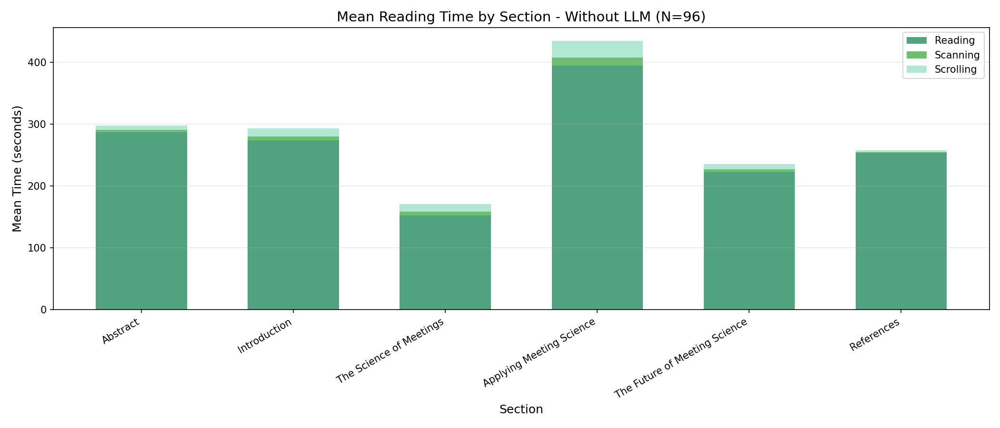
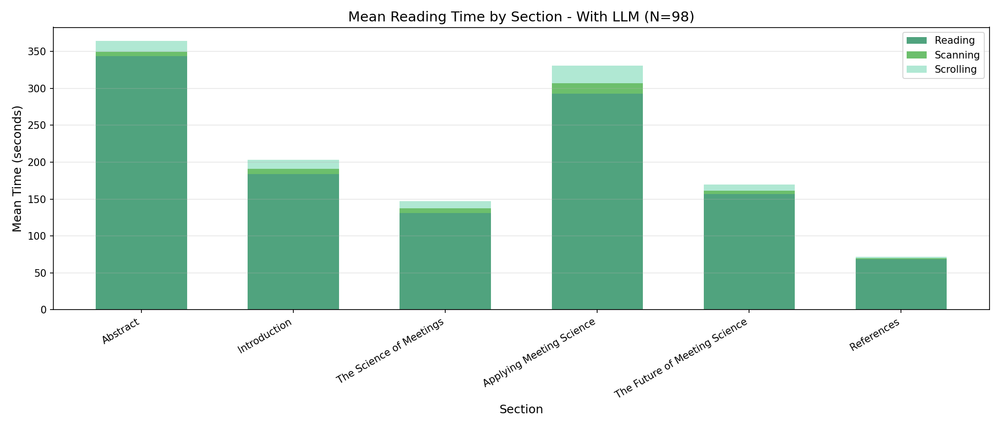
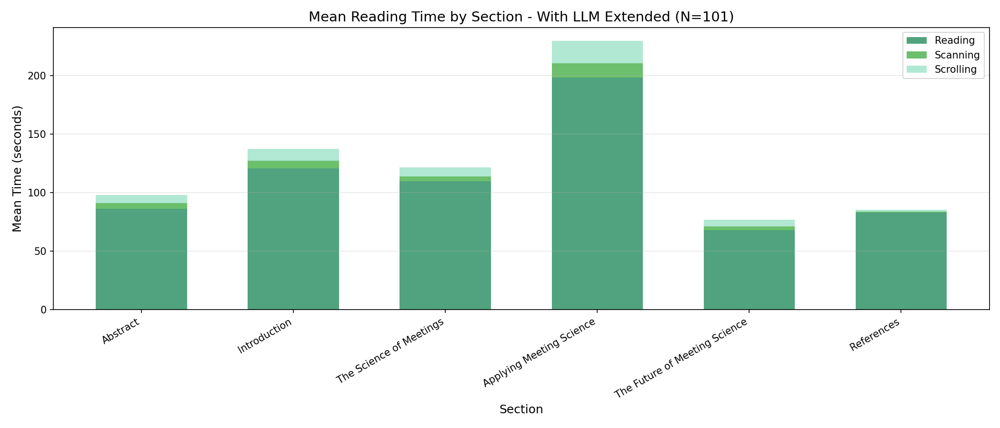

# Reading Pattern Analysis Report

Generated: 2025-12-23 20:56:28

---

## 1. Reading Ratio Analysis

### Definition

**Reading Ratio** = Reading Time / (Reading Time + Scanning Time + Scrolling Time)

This metric represents the proportion of active reading time relative to total document interaction time.
A higher ratio indicates more focused, deliberate reading behavior.

### 1.1 Descriptive Statistics

#### Overall

| Metric | Value |
|--------|-------|
| N | 295 |
| Mean | 0.8964 (89.6%) |
| SD | 0.1328 |
| SE | 0.0077 |

#### By Condition

| Condition | N | Mean | SD | SE |
|-----------|---|------|----|----|
| Without LLM | 96 | 0.9419 (94.2%) | 0.0568 | 0.0058 |
| With LLM | 98 | 0.8820 (88.2%) | 0.1484 | 0.0150 |
| With LLM Extended | 101 | 0.8671 (86.7%) | 0.1562 | 0.0155 |

### 1.2 One-way ANOVA

**Hypothesis:**
- H0: Reading ratio is equal across all conditions
- H1: At least one condition differs in reading ratio

#### ANOVA Table

| Source | SS | df | MS | F | p |
|--------|----:|---:|----:|---:|---:|
| Between Groups | 0.305823 | 2 | 0.152911 | 9.147 | 0.0001 |
| Within Groups | 4.881271 | 292 | 0.016717 | | |
| Total | 5.187094 | 294 | | | |

**Results:** F(2, 292) = 9.147, p = 0.0001, η² = 0.0590 (small)

The effect of condition on reading ratio is **significant** at α = .05.

### 1.3 Post-hoc Analysis (Tukey HSD)

Since the ANOVA was significant, Tukey's Honestly Significant Difference (HSD) test was conducted
to determine which specific pairs of conditions differ significantly.

#### Pairwise Comparisons

| Comparison | Mean Diff | SE | q | p | Cohen's d | Significant |
|------------|-----------|-----|-----|-----|-----------|-------------|
| Without LLM vs With LLM | 0.0599 | 0.0131 | 4.565 | 0.0001 | 0.464 | Yes* |
| Without LLM vs With LLM Extended | 0.0748 | 0.0130 | 5.739 | 0.0000 | 0.578 | Yes* |
| With LLM vs With LLM Extended | 0.0149 | 0.0130 | 1.146 | 0.2693 | 0.115 | No |

*Note: p < .05 indicates significant difference*

#### Significant Differences Summary

- **Without LLM** (94.2%) had significantly higher reading ratio than **With LLM** (88.2%), p = 0.0001, Cohen's d = 0.464
- **Without LLM** (94.2%) had significantly higher reading ratio than **With LLM Extended** (86.7%), p = 0.0000, Cohen's d = 0.578

---

## 2. Reading Time by Section

### Definition

Mean pause duration (seconds) spent on each section before scrolling, aggregated across all participants per condition.

### 2.1 Mean Time by Section and Condition

| Section | Without LLM | With LLM | With LLM Extended |
|---------|------|------|------|
| Abstract | 31.21s (±213.64) | 27.35s (±608.71) | 8.24s (±29.60) |
| Introduction | 16.03s (±76.19) | 9.96s (±63.28) | 7.48s (±31.14) |
| The Science of Meetings | 9.45s (±42.00) | 9.13s (±52.24) | 9.16s (±41.59) |
| Applying Meeting Science | 10.27s (±71.71) | 8.27s (±34.28) | 6.40s (±28.80) |
| The Future of Meeting Science | 18.45s (±72.94) | 12.54s (±57.27) | 6.99s (±33.23) |
| References | 92.23s (±770.94) | 23.53s (±85.42) | 27.58s (±122.30) |

### 2.2 Visualization

#### Without LLM (N=96)

#### With LLM (N=98)

#### With LLM Extended (N=101)

---

## 3. Summary

### Key Findings

1. **Reading Ratio:**
   - Overall mean: 89.6% of interaction time spent reading
   - Highest: Without Llm (94.2%)
   - Lowest: With Llm Extended (86.7%)
   - ANOVA: F(2, 292) = 9.147, p = 0.0001

2. **Section Reading Patterns:**
   - Most time spent on: References (47.78s avg)
   - Least time spent on: Applying Meeting Science (8.31s avg)

---

## 4. LLM and Extended Resources Usage Analysis

This section analyzes LLM usage patterns for the `with_llm` and `with_llm_extended` conditions.

### 4.1 Media Usage Time Ratio

#### With LLM (N=98)

| Media | Mean Time | SD | % of Total |
|-------|-----------|-----|------------|
| Reading | 21.43 min | 35.67 | 73.4% |
| LLM Chat | 7.77 min | 9.28 | 26.6% |
| **Total** | **29.21 min** | | |

#### With LLM Extended (N=101)

| Media | Mean Time | SD | % of Total |
|-------|-----------|-----|------------|
| Reading | 12.63 min | 7.25 | 52.4% |
| LLM Chat | 7.06 min | 7.59 | 29.3% |
| Video | 1.68 min | 2.70 | 7.0% |
| Audio | 1.61 min | 3.09 | 6.7% |
| Infographics | 1.14 min | 3.08 | 4.7% |
| **Total** | **24.13 min** | | |

### 4.2 LLM Query Statistics

| Condition | N | Mean Queries | SD | Min | Max |
|-----------|---|--------------|-----|-----|-----|
| With LLM | 98 | 2.15 | 3.08 | 0 | 14 |
| With LLM Extended | 101 | 3.08 | 6.30 | 0 | 37 |

### 4.3 LLM Usage Timeline

Interactive visualization showing when each participant used the LLM during their reading session.

[View LLM Usage Timeline (HTML)](./llm_usage_timeline.html)
